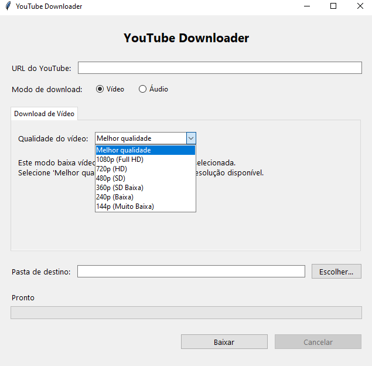

# YouTube Downloader
Uma aplicação desktop portátil para download de vídeos e áudios do YouTube, com interface gráfica amigável.



## 🌟 Recursos
- 📹 Download de vídeos em múltiplas qualidades (1080p, 720p, 480p, etc.)
- 🎵 Extração de áudio em diferentes formatos (MP3, M4A, etc.)
- 🔄 Conversão entre formatos de áudio
- 📂 Seleção personalizada de pastas de destino
- 📊 Barra de progresso em tempo real
- 💻 Interface intuitiva e amigável
- 📦 Aplicação completamente portátil

## 📋 Pré-requisitos
**Para desenvolvimento:**
- Python 3.6 ou superior
- tkinter (geralmente incluído com Python)
- [PyInstaller](https://pyinstaller.org/) (para criação do executável)

**Para execução do executável final:**
- Nenhum pré-requisito! A aplicação é completamente portátil.

## 🚀 Instalação para Desenvolvimento
1. Clone o repositório:
   ```
   git clone https://github.com/Joao-paulo19/youtube-downloader.git
   cd youtube-downloader
   ```
2. Instale as dependências:
   ```
   pip install pyinstaller
   ```
3. Baixe as ferramentas necessárias (não incluídas no repositório devido ao tamanho):
   - [yt-dlp.exe](https://github.com/yt-dlp/yt-dlp/releases) (baixe e coloque na pasta do projeto)
   - [ffmpeg.exe](https://ffmpeg.org/download.html) (baixe e coloque na pasta do projeto)
   
   **Nota**: Estes arquivos são necessários para o funcionamento do programa, mas não estão incluídos no repositório devido às limitações de tamanho do GitHub.

## 💻 Uso
### Executando a versão de desenvolvimento
```
python youtube_downloader.py
```

### Criando o executável
```
pyinstaller youtube_downloader.spec
```
O executável será criado na pasta `dist/YouTube Downloader/`.

## 📝 Guia de Uso
### Download de Vídeos
1. Insira a URL do vídeo do YouTube
2. Selecione "Vídeo" como modo de download
3. Escolha a qualidade de vídeo desejada
4. Selecione a pasta de destino
5. Clique em "Baixar"

### Download de Áudio
1. Insira a URL do vídeo do YouTube
2. Selecione "Áudio" como modo de download
3. Escolha a qualidade e o formato de áudio desejados
4. Selecione a pasta de destino
5. Clique em "Baixar"

### Conversão de Áudio
1. Navegue até a aba "Conversão de Áudio"
2. Selecione o arquivo de áudio de origem
3. Escolha o formato de saída desejado
4. Clique em "Converter"

## 📁 Estrutura do Projeto
```
YouTube Downloader/
├── icon.ico                # Ícone da aplicação
├── readme.md               # Este arquivo
├── screenshot.png          # Captura de tela da aplicação
├── youtube_downloader.py   # Código-fonte principal
├── youtube_downloader.spec # Arquivo de configuração do PyInstaller
├── .gitignore              # Arquivos ignorados pelo Git
└── [Arquivos necessários para execução - não incluídos no repositório]
    ├── ffmpeg.exe          # Ferramenta de processamento de áudio/vídeo
    └── yt-dlp.exe          # Motor de download de vídeos
```

**Nota**: Os arquivos ffmpeg.exe e yt-dlp.exe precisam ser baixados separadamente e colocados na mesma pasta do executável devido às limitações de tamanho do GitHub.

## 🛠️ Tecnologias Utilizadas
- [Python](https://www.python.org/) - Linguagem de programação principal
- [Tkinter](https://docs.python.org/3/library/tkinter.html) - Framework para interface gráfica
- [yt-dlp](https://github.com/yt-dlp/yt-dlp) - Motor de download de vídeos 
- [FFmpeg](https://ffmpeg.org/) - Processamento de áudio e vídeo
- [PyInstaller](https://pyinstaller.org/) - Criação de executável

## 🤝 Contribuições
Contribuições são bem-vindas! Sinta-se à vontade para abrir uma issue ou enviar um pull request.

1. Fork o projeto
2. Crie sua Feature Branch (`git checkout -b feature/AmazingFeature`)
3. Commit suas alterações (`git commit -m 'Add some AmazingFeature'`)
4. Push para a Branch (`git push origin feature/AmazingFeature`)
5. Abra um Pull Request

## 📧 Contato
João Paulo - [@Joao-paulo19](https://github.com/Joao-paulo19)

LinkedIn: [https://www.linkedin.com/in/joao-paul0/](https://www.linkedin.com/in/joao-paul0/)  
Email: joaopaulomariaalvarenga@gmail.com

Link do projeto: [https://github.com/Joao-paulo19/youtube-downloader](https://github.com/Joao-paulo19/youtube-downloader)