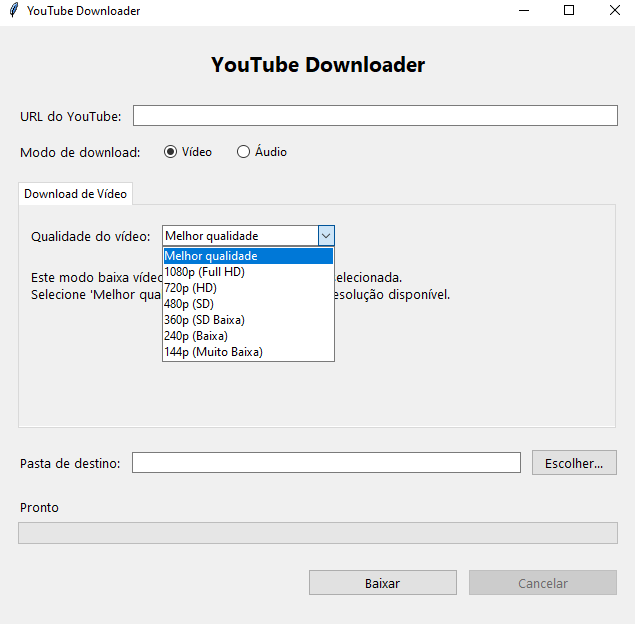

# YouTube Downloader
Uma aplicação desktop portátil para download de vídeos e áudios do YouTube, com interface gráfica.



## 🌟 Recursos
- 📹 Download de vídeos em múltiplas qualidades (1080p, 720p, 480p, etc.)
- 🎵 Extração de áudio em diferentes formatos (MP3, M4A, WAV, OPUS, FLAC)
- 📂 Seleção personalizada de pastas de destino
- 📊 Barra de progresso em tempo real
- 💻 Interface intuitiva com abas organizadas
- 📦 Aplicação completamente portátil
- 🔍 Detecção automática de downloads duplicados
- ✅ Validação automática de dependências
- 🔒 Validação de URLs para segurança
- ❌ Cancelamento de downloads em andamento

## 📋 Pré-requisitos
**Para desenvolvimento:**
- Python 3.6 ou superior
- tkinter (geralmente incluído com Python)
- [PyInstaller](https://pyinstaller.org/) (para criação do executável)

**Para execução do executável final:**
- Nenhum pré-requisito! A aplicação é completamente portátil.

## 🚀 Instalação para Desenvolvimento
1. Clone o repositório:
    ```
    git clone [https://github.com/Joao-paulo19/youtube-downloader.git](https://github.com/Joao-paulo19/youtube-downloader.git)
    cd youtube-downloader
    ```
2. Instale as dependências do Python:
    ```
    pip install pyinstaller
    ```
3. Baixe as ferramentas externas:

    ### ⚠️ Importante: Obtendo as Dependências Corretas

    Para evitar problemas de download e conversão, siga estas recomendações:

    * **`yt-dlp.exe`**:
        * Baixe a última versão diretamente do GitHub: [**yt-dlp Releases**](https://github.com/yt-dlp/yt-dlp/releases).
        * Coloque o `yt-dlp.exe` na pasta raiz do projeto.

    * **`ffmpeg.exe`**:
        * A causa mais comum de falhas (vídeos sem som, conversões que não funcionam) é uma versão incompleta ou corrompida do FFmpeg.
        * Recomendamos baixar uma build completa e confiável para Windows, como as disponíveis em [**Gyan.dev**](https://www.gyan.dev/ffmpeg/builds/).
        * Baixe a versão **`ffmpeg-release-full.zip`**, descompacte, entre na pasta `bin` e copie o `ffmpeg.exe` (e preferencialmente o `ffprobe.exe`) para a pasta raiz do projeto.

    **Nota**: A aplicação verifica automaticamente se estas dependências estão disponíveis localmente ou no PATH do sistema. Ter os arquivos na mesma pasta do projeto é a forma mais garantida de funcionamento.

## 💻 Uso
### Executando a versão de desenvolvimento
````

python youtube\_downloader.py

````

### Criando o executável
````

pyinstaller youtube\_downloader.spec

````
O executável será criado na pasta `dist/YouTube Downloader/`.

## 📝 Guia de Uso
### Download de Vídeos
1. Insira a URL do vídeo do YouTube (a aplicação valida automaticamente)
2. Selecione "Vídeo" como modo de download
3. Escolha a qualidade de vídeo desejada na aba "Download de Vídeo"
4. Selecione a pasta de destino (permissões são verificadas automaticamente)
5. Clique em "Baixar"

### Download de Áudio
1. Insira a URL do vídeo do YouTube
2. Selecione "Áudio" como modo de download
3. Na aba "Download de Áudio", escolha:
    - Qualidade do áudio (Melhor qualidade, 320kbps, 256kbps, etc.)
    - Formato de saída (mp3, m4a, wav, opus, flac)
4. Selecione a pasta de destino
5. Clique em "Baixar"

### Gerenciamento de Downloads
- **Cancelamento**: Use o botão "Cancelar" para interromper downloads em andamento
- **Progresso**: Acompanhe o progresso em tempo real através da barra de progresso
- **Duplicatas**: A aplicação detecta automaticamente downloads duplicados e oferece opções

## 🛠️ Tecnologias Utilizadas
- [Python](https://www.python.org/) - Linguagem de programação principal
- [Tkinter](https://docs.python.org/3/library/tkinter.html) - Framework para interface gráfica
- [yt-dlp](https://github.com/yt-dlp/yt-dlp) - Motor de download de vídeos
- [FFmpeg](https://ffmpeg.org/) - Processamento de áudio e vídeo
- [PyInstaller](https://pyinstaller.org/) - Criação de executável

## 🐛 Solução de Problemas (Troubleshooting Avançado)

Se encontrar algum problema, siga os passos abaixo. Eles resolvem 99% dos erros comuns.

---

### **Problema 1: O download falha com erro `HTTP Error 403: Forbidden` ou para no meio.**

Este é o erro mais comum e acontece porque o YouTube muda suas formas de proteção constantemente.

* **Causa:** Sua versão do `yt-dlp.exe` está desatualizada e não consegue mais se comunicar corretamente com o YouTube.

* **Solução Rápida:** Abra um terminal (CMD ou PowerShell) na pasta do projeto e execute o comando de atualização do yt-dlp:
    ```
    yt-dlp.exe -U
    ```
    Este comando irá atualizar o `yt-dlp` para a versão mais recente, que quase sempre corrige problemas de download. **Faça isso antes de tentar qualquer outra coisa!**

---

### **Problema 2: O vídeo baixa, mas o arquivo final não tem som.** ou **O áudio é extraído, mas o arquivo fica mudo.**

* **Causa:** Este problema é quase sempre causado por uma versão do **`ffmpeg.exe`** que está corrompida, incompleta ou não possui os codecs necessários para juntar (`muxing`) o vídeo e o áudio ou para converter o formato.

* **Solução:**
    1.  **Garanta que você tem uma versão completa do FFmpeg:** Siga as instruções na seção de instalação e baixe a versão **`full`** do [Gyan.dev](https://www.gyan.dev/ffmpeg/builds/). Substitua seu `ffmpeg.exe` antigo.
    2.  **Verifique os codecs do seu sistema:** Em casos raros, o problema pode ser a falta de codecs no seu Windows para reproduzir o áudio (geralmente no formato *Opus* ou *AAC*). Para corrigir isso, instale um pacote de codecs confiável como o [K-Lite Codec Pack](https://codecguide.com/download_kl.htm).

---

### **Problema 3: A aplicação exibe o erro "Dependências não encontradas".**

* **Causa:** Os arquivos `yt-dlp.exe` e/ou `ffmpeg.exe` não estão na mesma pasta do `YouTube Downloader.exe` nem foram encontrados no PATH do sistema.

* **Solução:** Certifique-se de que ambos os executáveis (`yt-dlp.exe` e `ffmpeg.exe`) foram baixados e estão localizados no mesmo diretório que o executável da sua aplicação.

---

### **Para Outros Erros**

Se os passos acima não resolverem, execute o download manualmente pelo terminal para ver a mensagem de erro completa. Abra o CMD na pasta do projeto e use um comando como este:
````

yt-dlp.exe -f "bestvideo+bestaudio" "URL\_DO\_SEU\_VIDEO"

````
A mensagem de erro detalhada que aparecer no terminal ajudará a identificar a causa raiz do problema.

## 🤝 Contribuições
Contribuições são bem-vindas! Sinta-se à vontade para abrir uma issue ou enviar um pull request.

### Áreas para Melhoria
- Interface para múltiplas operações simultâneas

1. Fork o projeto
2. Crie sua Feature Branch (`git checkout -b feature/AmazingFeature`)
3. Commit suas alterações (`git commit -m 'Add some AmazingFeature'`)
4. Push para a Branch (`git push origin feature/AmazingFeature`)
5. Abra um Pull Request

## 📧 Contato
João Paulo - [@Joao-paulo19](https://github.com/Joao-paulo19)

LinkedIn: [https://www.linkedin.com/in/joao-paul0/](https://www.linkedin.com/in/joao-paul0/)
Email: joaopaulomariaalvarenga@gmail.com

Link do projeto: [https://github.com/Joao-paulo19/youtube-downloader](https://github.com/Joao-paulo19/youtube-downloader)
