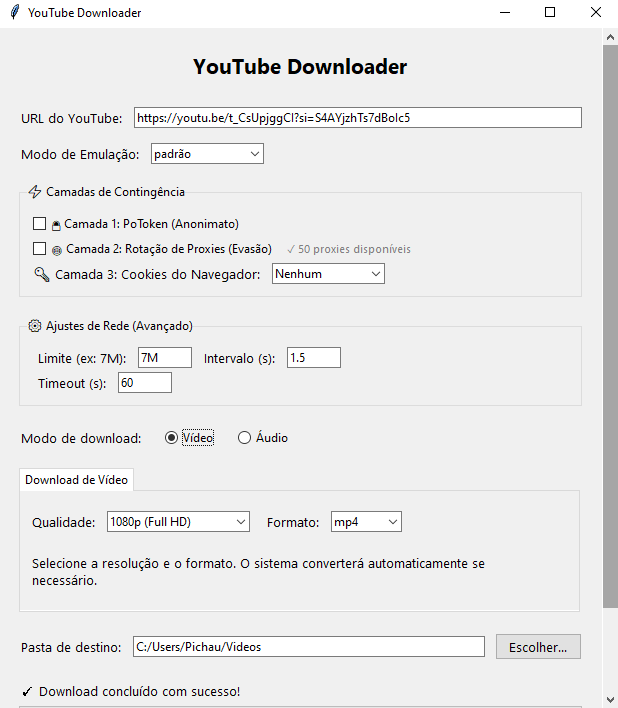

# 📺 YouTube Downloader

Baixa vídeos (até 4K) e áudios (MP3/FLAC/etc) do YouTube. Versão desktop com interface gráfica.

---



---

## 🏗️ Estrutura do Projeto

Para que o sistema funcione ou seja compilado, sua pasta deve seguir este padrão:

```text
/projeto
├── youtube_downloader.py      # Código principal (GUI e lógica)
├── youtube_downloader.spec    # Configuração de compilação (PyInstaller)
├── instalar_dependencias.py   # Script de automação de bibliotecas
├── icon.ico                   # Ícone do executável
├── yt-dlp.exe                 # Motor de download (Obrigatório)
├── ffmpeg.exe                 # Motor de processamento de mídia (Obrigatório)
└── deno.exe                   # Motor JS para bypass de segurança (Obrigatório)

```

---

## ⚡ Instalação e Preparação

### 1. Binários Obrigatórios (Executáveis)

Como o GitHub não armazena arquivos `.exe`, você deve baixar os motores manualmente:

1. **yt-dlp.exe:** [Baixe aqui](https://github.com/yt-dlp/yt-dlp/releases).
2. **ffmpeg.exe:** [Baixe aqui](https://www.gyan.dev/ffmpeg/builds/). Pegue o `ffmpeg-release-full.zip`, entre na pasta `bin` e extraia o `ffmpeg.exe`.
3. **deno.exe:** [Baixe aqui](https://github.com/denoland/deno/releases). Baixe o `deno-x86_64-pc-windows-msvc.zip` e extraia o `deno.exe`.

### 2. Dependências do Python

O projeto requer o **Python 3.13**. Para instalar todas as bibliotecas de rede necessárias de uma só vez, execute:

```bash
python instalar_dependencias.py

```

*Este script automatiza a instalação das bibliotecas `requests`, `urllib3`, `certifi`, `idna` e `charset-normalizer`.* 

---

## 🛡️ Entendendo as Configurações Avançadas

O sistema possui abas e quadros que permitem contornar as travas do YouTube:

### ⚡ Camadas de Contingência

O download agora funciona com um **fluxo inteligente**: o programa tenta o download direto primeiro; se o YouTube bloquear, ele aciona as camadas que você marcar: 

* 
**Camada 1 (PoToken):** Usa o `deno.exe` para gerar chaves de anonimato que provam ao YouTube que você é um visitante "íntegro". 


* 
**Camada 2 (Proxies):** O programa busca automaticamente uma lista de IPs pelo mundo para "disfarçar" sua conexão. 


* **Camada 3 (Cookies):** Permite usar o login do seu navegador (Brave, Chrome, Firefox, etc.) para validar o acesso. **Dica:** O navegador deve estar fechado para esta camada funcionar. 


### ⚙️ Ajustes de Rede

Permite personalizar como o programa se comporta na internet:

* **Limite de Velocidade:** Padrão `7M`. Evita que o YouTube detecte picos de tráfego anormais. 


* **Intervalo (s):** Tempo de espera entre pedidos. Ajuda a não ser banido como robô. 


* 
**Timeout (s):** Tempo que o programa espera a resposta do servidor antes de desistir. 


### 📱 Modo de Emulação

Simula diferentes dispositivos (Android VR, iOS, etc.). O YouTube trata apps de celular de forma diferente de navegadores de PC, o que ajuda a furar bloqueios de região ou restrições de idade. 

---

## 📦 Como gerar o seu Executável (.exe)

Com os binários na pasta e as dependências instaladas, rode:

```bash
pyinstaller youtube_downloader.spec

```

O programa finalizado aparecerá na pasta `dist/YouTube Downloader/`. 

---

## 🔧 Solução de Problemas

* **Vídeo sem som no player do Windows:** O player "Filmes e TV" nativo às vezes não tem os codecs modernos. O sistema agora força o áudio em **AAC** para aumentar a compatibilidade, mas recomendamos o uso do **VLC Media Player**. 


* 
**Erro 403 Persistente:** Tente atualizar o motor de download rodando `yt-dlp.exe -U` no CMD dentro da pasta do programa. 


* **Sistema de Logs:** Sempre que ocorrer um erro, o programa perguntará se deseja salvar um log. Esse arquivo contém todos os detalhes técnicos (URL, Camada usada, Proxy) para facilitar o diagnóstico. 


---

### 🔄 Mantendo o Sistema Atualizado

O YouTube atualiza seus algoritmos quase diariamente. Se o programa parar de baixar ou apresentar erros constantes, você deve atualizar os três motores principais:

#### 1. yt-dlp.exe (O mais importante)

Este executável possui um comando interno de auto-atualização.

* **Como atualizar:** Abra o CMD dentro da pasta do programa e digite:
```bash
yt-dlp.exe -U

```


#### 2. ffmpeg.exe (Processamento de Mídia)

O FFmpeg não possui comando de auto-atualização. Ele deve ser substituído manualmente a cada 3 ou 4 meses para garantir suporte aos novos codecs de vídeo.

* **Como atualizar:** Baixe a versão mais recente (Release Full) no site [Gyan.dev](https://www.gyan.dev/ffmpeg/builds/) e substitua o arquivo antigo pelo novo na pasta raiz.

#### 3. deno.exe (Bypass de Segurança)

O Deno é responsável por gerar os tokens de segurança. Se ele estiver desatualizado, o YouTube pode rejeitar as chaves geradas.

* **Como atualizar:** Baixe a versão estável mais recente em [Deno Releases](https://github.com/denoland/deno/releases) (procure pelo arquivo `.zip` para Windows x64) e substitua o executável atual.

---

## 📧 Contato

**João Paulo** GitHub: [@Joao-paulo19](https://github.com/Joao-paulo19) | LinkedIn: [joao-paul0](https://www.linkedin.com/in/joao-paul0/)
